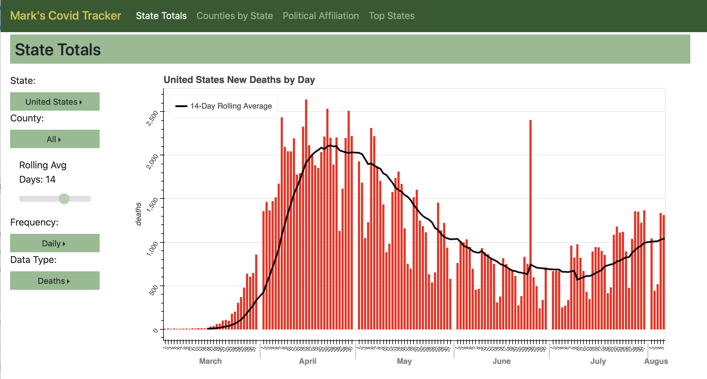
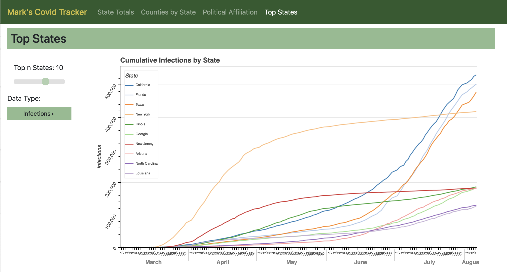

# Mark's Covid Tracker
###Django-based Covid Tracker presented with Bokeh Visualizations

This application is based on publicly available data from the Johns Hopkins University Center for Systems Science in Engineering.
"Dong E, Du H, Gardner L. An interactive web-based dashboard to track COVID-19 in real time. Lancet Inf Dis. 20(5):533-534. doi: 10.1016/S1473-3099(20)30120-1"

This page is hosted at:

https://markscovidtracker.azurewebsites.net/

(This is hosted with a free student account so the initial load time may be slow as the application wakes up)

## Application Architecture
The application uses a Django web server to present various Bokeh visualizations of infection and death rates in the US by state, county and political affiliation.  Javascript is used to put the visualizations on the html page.  Interactions will call the Django server for an updated chart and insert it into the local page.  Data is gathered from the John's Hopkins GIT repo and is refreshed when the page is loaded.

## Quick Start

To use the tracker locally:
1.  Clone this repo
2.  Install pipenv

    `pip install pipenv`
3.  Get a census application key (https://api.census.gov/data/key_signup.html)
4.  Create a .env file and add variables as decribed below
5.  Launch the pipenv virtual environment

    `pipenv shell`
6.  If running a production environment (`WORKSPACE=PROD`), update the static files using 

    `python manage.py collectstatic`
     
6.  Start the Django server from the `/tracker/tracker` directory

    `python manage.py runserver`

## Local Environment Variables
Before the application can be executed locally, 3 local environment variables must be created.
1.  DJANGO_SECRET_KEY:
This can be anything you choose.
2.  CENSUS_API_KEY: Get a key at https://api.census.gov/data/key_signup.html
3.  WORKSPACE: `PROD` or `DEV`.  `PROD` will disable Django debugging and force the Docker version of the application to execute within a WSGI wrapper.

Each of these variables must be created in a `.env` file saved in the root folder.

## Execution
Once the local environment variables have been saved in a local `.env` file, the application can be run natively from Django or can be packed as a Docker container.

#### Run from Django
To run from Django, navigate to the `tracker/tracker` directory:
    
    python manage.py runserver
    
#### Django with a Web Server Gateway
Alternatively, the application can be run using gunicorn WSGI as well:

    gunicorn --bind 0.0.0.0:8000 --workers 4 --timeout 600 tracker.wsgi

#### Docker
To use the application from a Docker container, an image must first be created.  From the root:

    docker build . -t covid_tracker
    
After the image is created, a container can be created and run:

    docker run --rm --env-file ./.env -it -p 8080:8000 covid_tracker

The docker container can also be built and executed using docker-compose:

    docker-compose build
    docker-compose up

The site can be accessed locally at http://127.0.0.1:8000

## Extending the Application
The application has been designed to be extensible and accommodate new visualizations.  To do this, you will need familiarity with Python, Bokeh and Javascript.  

Following the repo examples as a starting point is recommended. 

To add new visualization:
1. Create bokeh visualization with a function accepts a request which has named variables their default values for the chart.

    The code should be placed in the 'views' directory.

    The function which creates the bokeh chart must include a request variable as the first argument.  

    ex: `plot_mychart(request, color='red', animal='frog')`

    The plotting function must return a `django.JsonResponse(bokeh.json_item(p))`, where `p` is the bokeh plot.

    The function can include variables in addition to the 'request', but the http nature of the application requires that variables are extracted from the 'request' object.  See the other visualizations as an example.  

2.  Create javascript function to add control elements.  See the `draw_covid_tracker()` function in the `covid_js.js` script for an example of how to place the bokeh chart into HTML.

4. Update the `tracker/tracker/covid_tracker/urls.py` file to include the new path.  The path must match the path name created when updating the `draw_covid_tracker()` function.

## Serving Static Files in Production
(https://dev.to/learndjango/django-static-files-tutorial-1fg7)
For production, static files are centrally collected using `python manage.py collectstatic`.  This will store the static files into a directory identified in settings as 'STATIC_ROOT'.  We then use Whitenoise to serve the static files in production.

This configuration requires several new variables in the settings.py confuration under the static files section.  This is handled in the docker-entrypoint.sh script when publishing using Docker but will need to be manually executed if running a production instance from Django.

Important: changes to static files under the app directory will require you to run `python manage.py collectstatic` to update the centrally managed static files.

## Publishing to Azure
Before publishing to Azure, you will need an Azure account and need to login locally.

The following command will build  an image and publish it to your Azure registry:

`az acr build --image covid_tracker --registry {your_registry_name} --file Dockerfile .`
